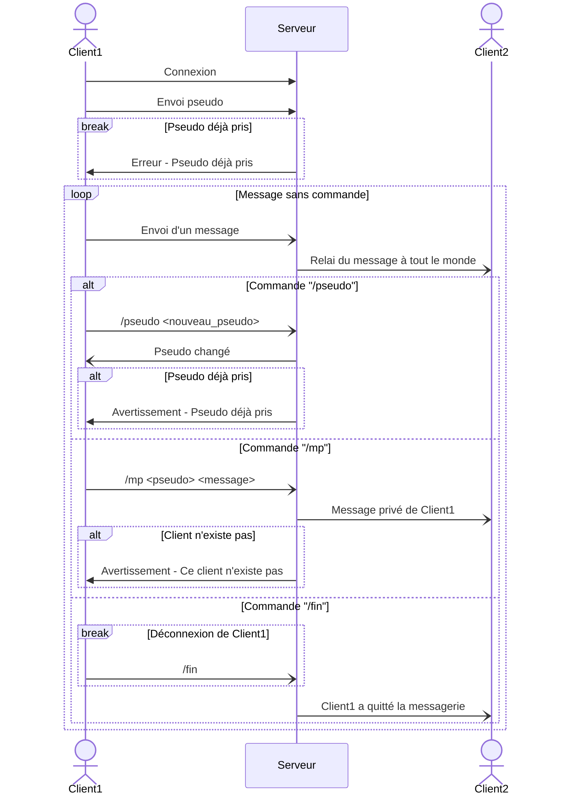

```mermaid
sequenceDiagram
  actor Client1
  participant Serveur
  actor Client2

  Client1->>Serveur: Connexion
  Client1->>Serveur: Envoi pseudo
  break Pseudo déjà pris
    Serveur->>Client1: Erreur - Pseudo déjà pris
  end

  loop Message sans commande
    Client1 -) Serveur: Envoi d'un message
    Serveur -) Client2: Relai du message à tout le monde

    alt Commande "/pseudo"
      Client1 -) Serveur: /pseudo <nouveau_pseudo>
      Serveur -) Client1: Pseudo changé
      alt Pseudo déjà pris
        Serveur->>Client1: Avertissement - Pseudo déjà pris
      end
    else Commande "/mp"
      Client1 -) Serveur: /mp <pseudo> <message>
      Serveur -) Client2: Message privé de Client1
      alt Client n'existe pas
        Serveur->>Client1: Avertissement - Ce client n'existe pas
      end
    else Commande "/fin"
      break Déconnexion de Client1
        Client1 -) Serveur: /fin
      end
      Serveur -) Client2: Client1 a quitté la messagerie
    end
  end

```
